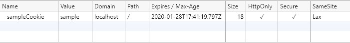

# SameSite Cookie Sample
## .NET Framework 3.5
### Summary

.NET Framework 3.5 has no built-in support for the [sameSite](https://www.owasp.org/index.php/SameSite) attribute, however it can be added to a cookie by 
manually appending the attribute and value to the `Path` property on a `Cookie` instance.

*This code is unsupported, and Microsoft will only support you for sameSite issues if you upgrade to .NET 4.7.2.*

## <a name="sampleCode"></a>Writing the sameSite attribute

Following is an example of how to write a sameSite attribute on a cookie;

```c#
// Create the cookie
HttpCookie sameSiteCookie = new HttpCookie("SameSiteSample");

// Set a value for the cookie
sameSiteCookie.Value = "sample";

// Set the secure flag, which Chrome's changes will require for SameSite none.
// Note this will also require you to be running on HTTPS
sameSiteCookie.Secure = true;

// Set the cookie to HTTP only which is good practice unless you really do need
// to access it client side in scripts.
sameSiteCookie.HttpOnly = true;

// Add the SameSite attribute
// As .NET 3.5 does not support SameSite as a property you
// must append the attribute and value to the cookie path property
sameSiteCookie.Path += "; sameSite=Lax";

// Add the cookie to the response cookie collection
Response.Cookies.Add(sameSiteCookie);
```

If you examine the `Path` property on an inbound cookie written using this method you will see the sameSite attribute appended to it.
This should not have any side effects in your code, the `Path` property is a hint for browsers, not for use server side.

### Running the sample

If you run the sample project please load your browser debugger on the initial page and use it to view the cookie collection for the site.
To do so in Edge and Chrome press `F12` then select the `Application` tab and click the site URL under the `Cookies` option in the `Storage` section.



You can see from the image above that the cookie created by the sample when you click the "Create SameSite Cookie" button has a SameSite attribute value of `Lax`,
matching the value set in the [sample code](#sampleCode).

## Intercepting cookies you do not control

In .NET 3.5 there is no reliable way to intercept responses outside of an unmanaged IIS module. While you may be tempted to use the `Application_PreSendRequestHeaders`
global event it is [unreliable](https://docs.microsoft.com/en-us/dotnet/api/system.web.httpapplication.presendrequestheaders?view=netframework-3.5) and is unaware 
of any modules in your ASP.NET pipeline. Attempting to use this event will cause Access Violation exceptions that will crash the process hosting your application. 

However you can you can intercept the request/response pipeline to adjust the session and forms authentication cookies before it is written back to the client. The sample code creates a session 
cookie and a forms authentication cookie, which in .NET 3.5 are unaware of the sameSite attribute so the 
[global.asax](Global.asax.cs) `Application_PostAcquireRequestState` event is then used to intercept the response. 
The sample adds both the sameSite attribute and adjusts the `Secure` property to the session and forms authentication 
cookies to match the new changes made in Chrome. Your website must be running on HTTPS for the secure flag to work as 
expected. This technique reliably works for the session and forms authentication cookies due to where the are 
created in the asp.net pipeline, it may not work for cookies that are created outside of typical location, if
you have other cookies you wish to adjust you will need to experiment to see if this technique works for them.

```c#
public class Global : System.Web.HttpApplication
{
    protected void Application_PostAcquireRequestState(object sender, EventArgs e)
    {
        // Set SessionState cookie to SameSite=None
        if (sender is HttpApplication app)
        {
            if (SameSite.BrowserDetection.AllowsSameSiteNone(app.Request.UserAgent))
            {
                string[] allKeys = app.Response.Cookies.AllKeys;
                foreach (string cookieName in allKeys)
                {
                    switch (cookieName)
                    {
                        case "ASP.Net_SessionId":
                        case ".ASPXAUTH":
                            SetSameSite(app.Response.Cookies[cookieName], "None");
                            break;
                        default:
                            break;
                     }
                }
            }
        }
    }

    private void SetSameSite(HttpCookie c, string sameSiteValue)
    {
        const string sameSiteAttribute = "sameSite=";

        if (c == null)
        {
            return;
        }

        // Cookie already has a sameSite value. Replace it.
        if (c.Path.Contains(sameSiteAttribute))
        {
            // Find the sameSite value
            string[] pathParts = c.Path.Split(new char[] { ';' });
            for (int i = 0; i < pathParts.Length; i++)
            {
                // Update the SameSite value
                if (pathParts[i].Trim().StartsWith(sameSiteAttribute, StringComparison.InvariantCulture))
                {
                    pathParts[i] = " " + sameSiteAttribute + " " + sameSiteValue;
                }
            }

            // Replace the path
            c.Path = string.Join(";", pathParts);
        }
        else
        {
            // Adding a value where it didn't exist before is easy.
            c.Path += "; " + sameSiteAttribute + sameSiteValue;
        }

        // If we set the sameSite attribute to none the new Chrome changes also need it to be marked as secure.
        // Your website must be running on HTTPS for the Secure flag to work as expected.
        if (string.Compare("None", sameSiteValue, false, CultureInfo.InvariantCulture) == 0)
        {
            c.Secure = true;
        }
    }
}
```

## More Information

[Chrome Updates](https://www.chromium.org/updates/same-site)

[ASP.NET Documentation](https://docs.microsoft.com/en-us/aspnet/samesite/system-web-samesite)
