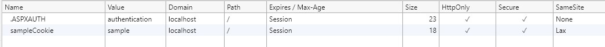

# SameSite Cookie Sample
## .NET Framework 4.5.2
### Summary

.NET Framework 4.5 has no built-in support for the [SameSite](https://www.owasp.org/index.php/SameSite) attribute, however it can be added to a cookie by 
manually appending the attribute and value to the `Path` property on a `Cookie` instance.

*This code is unsupported, and Microsoft will only support you for sameSite issues if you upgrade to .NET 4.7.2.*

## <a name="sampleCode"></a>Writing the SameSite attribute

Following is an example of how to write a SameSite attribute on a cookie;

```c#
// Create the cookie
HttpCookie sameSiteCookie = new HttpCookie("SameSiteSample");

// Set a value for the cookie
sameSiteCookie.Value = "sample";

// Set the secure flag, which Chrome's changes will require for SameSite none.
// Note this will also require you to be running on HTTPS
sameSiteCookie.Secure = true;

// Set the cookie to HTTP only which is good practice unless you really do need
// to access it client side in scripts.
sameSiteCookie.HttpOnly = true;

// Add the SameSite attribute
// As .NET 4.5 does not support SameSite as a property you
// must append the attribute and value to the cookie path property
sameSiteCookie.Path += "; sameSite=Lax";

// Add the cookie to the response cookie collection
Response.Cookies.Add(sameSiteCookie);
```

If you examine the `Path` property on an inbound cookie written using this method you will see the sameSite attribute appended to it.
This should not have any side effects in your code, the `Path` property is a hint for browsers, not for use server side.

### Running the sample

If you run the sample project please load your browser debugger on the initial page and use it to view the cookie collection for the site.
To do so in Edge and Chrome press `F12` then select the `Application` tab and click the site URL under the `Cookies` option in the `Storage` section.



You can see from the image above that the cookie created by the sample when you click the "Create Cookies" button has a SameSite attribute value of `Lax`,
matching the value set in the [sample code](#sampleCode).

## Intercepting cookies you do not control

.NET 4.5.2 introduced a new event for intercepting the writing of headers, `Response.AddOnSendingHeaders`. This can be used to intercept cookies before they
are returned to the client machine. In the sample we wire up the event to a static method which checks whether the browser supports the new sameSite changes,
and if not, changes the cookies to not emit the attribute if the new `None` value has been set.

See [global.asax](global.asax.cs) for an example of hooking up the event and
[SameSiteCookieRewriter.cs](SameSiteCookieRewriter.cs) for code to handling the event and 
adjusting the cookie `sameSite` attribute and to also enable you to set the sameSite attribute on the forms authentication
cookie and session cookie.

## More Information

[Chrome Updates](https://www.chromium.org/updates/same-site)

[ASP.NET Documentation](https://docs.microsoft.com/en-us/aspnet/samesite/system-web-samesite)

[.NET SameSite Patches](https://docs.microsoft.com/en-us/aspnet/samesite/kbs-samesite)